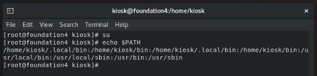
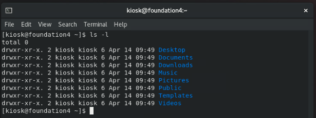

# CH 02：Linux 基礎操作指令
課程筆記：Linux 我來教: CentOS / RHEL 8 新世代雲端

---

## 單元 1 - Linux 的開機過程


#### BIOS / UEFI

此處的「[BIOS](https://zh.wikipedia.org/zh-tw/BIOS)」指的是傳統的「BIOS」系統，「BIOS」的全名為「Basic Input/Output System」，是在電腦啟動時與負責硬體相互溝通的主要程式；也是開機過程的第一站。

而「[UEFI](https://zh.wikipedia.org/zh-tw/%E7%B5%B1%E4%B8%80%E5%8F%AF%E5%BB%B6%E4%BC%B8%E9%9F%8C%E9%AB%94%E4%BB%8B%E9%9D%A2)」，全名為「Unified Extensible Firmware Interface」，也有人稱為「UEFI BIOS」，是「Legacy BIOS」的替代方案，示意圖如下：


#### GUN GRUB

而開機流程的第二站是「[GUN GRUB](https://zh.wikipedia.org/zh-tw/GNU_GRUB)」，它是一套主要用於「[Unix-like system](https://zh.wikipedia.org/zh-tw/%E7%B1%BBUnix%E7%B3%BB%E7%BB%9F)」的「[啟動程式（Bootloade）](https://zh.wikipedia.org/zh-tw/%E5%95%9F%E5%8B%95%E7%A8%8B%E5%BC%8F)」；我們可以將其視作「Linux」的「開機管理程式」，譬如在系統出問題時，我們就可以藉由「GRUB」中的一個設定來進入單人模式並執行系統的修復作業，例如在「RHCSA」認證的常見考題中，其就有透過獲取「Root」權限來修改密碼。

#### Linux Kernel

接著是「[Linux 核心](https://zh.m.wikipedia.org/zh-tw/Linux%E5%86%85%E6%A0%B8)」，它是一種開源的「Unix-like」作業系統單核心。

#### systemd（init）

當「Linux」在啟動時載入「Linux 核心」後，便會進到「init」，由「init」完成剩餘的開機過程，譬如載入執行級別、載入服務，或是否啟動文字「Shell」或是「圖形化」介面⋯等。

此外，大部分的「Linux 發行版」都已採用新的「systemd」來來替代傳統的「init」。

---

## 單元 2 - 指令操作、變身為超級使用者

#### 常見的符號

| 符號  | 說明                         |
| :---: | ---------------------------- |
|   ~   | 代表家目錄。                 |
|   /   | 代表根目錄。                 |
|   #   | 代表目前用戶權限為「Root」。 |
|   $   | 代表為一般使用者。           |

#### 常用的指令：

|  指令  | 說明                             |
| :----: | -------------------------------- |
|  pwd   | 顯示當前路徑。                   |
| whoami | 顯示當前用戶。                   |
|  echo  | 打印。                           |
| clear  | 清除畫面。                       |
|   su   | 變身為超級使用者「Super User」。 |

額外補充個知識點，一般當我們在使用「su」這個指令時，我們會經常會在後面加個「-」字號，變成「`su -`」，而非直接使用「su」；其主要原因與環境變數有關。

首先，我們可以藉由指令「`echo $PATH`」來打印環境變數的路徑，顯示結果如下：


然後，使用「`su`」變身為「Super User」，再執行一次指令「`echo $PATH`」，顯示結果如下：



然後，再使用「`su -`」變身為「Super User」，同樣執行指令「`echo $PATH`」，顯示結果如下：


另外，清除畫面除了輸入指令「clear」之外，亦可以使用一個「特殊字元」，輸入該特殊字元的方式是輸入「Ctrl + L」。

---

## 單元 3 - 基礎資料夾切換、列表、別名

#### 切換資料夾

在「Linux」中，切換資料夾的方法是藉由指令「cd」，並在後面接上路徑，我們可以直接輸入路徑位置，亦可使用「符號」來表示位置，如下：

| 符號  | 說明             |
| :---: | ---------------- |
|   ~   | 代表家目錄。     |
|   /   | 代表根目錄。     |
|   .   | 代表當前目錄。   |
|  ..   | 代表上一層目錄。 |

#### 顯示資料夾內容

在「Linux」中，若要顯示資料夾內容的可以使用指令「ls」，顯示結果如下：


其中，在預設的情況下，藍色表示資料夾。

若要顯示目錄詳細內容，加入參數「l」，指令為「`ls -l`」，顯示結果如下：



若要顯示隱藏檔案，則使用參數「a」，顯示結果如下：


其中，在「目錄名稱」前有個點「.」，就是隱藏檔；而僅有「.」的是指當前目錄，而「..」當然就是指「上一層目錄」。

亦可以混合著使用，顯示結果如下：


另外，「ls」除了可以顯示當前目錄內容外，我們亦可以指定目錄，只要在指令後面接上目錄位置即可，以「根目錄」為例，如下：


#### 別名

在某些情況下，我們會經常地使用某特定參數的指令，因此，為了方便使用者能簡潔且快速地操作，「Linux」提供了「alias」系統，並提供預設的「別名」指令；我們可以藉由「alias」指令來得知目前的已經存在的「別名」指令，如下：


其中的「ll」就等同於「ls -l」，當然，除了預設的「別名」指令，亦可以自定義。

---

### 單元 4 - Linux 主要目錄與辨讀權限

#### 目錄辨讀

在檔案目錄下，每個檔案資料夾的最前面都有「10」個字碼，如下：


這「10」個字碼，都是表示著該檔案的分類與權限，首先是第一碼，若其為「d」，則代表當前的項目「資料夾」；若其為「-」，則代表為「檔案」。

接著，後面「9」碼是以「3」個為一組，依左至右依序為「rwx」，這「3」碼為一組的代碼是用來表示特地組群對目標「檔案資料夾」的操作權限；其中，「r」代表「讀取（read）」，「w」代表「寫入（wrirte）」，「x」則代表「執行（execute）」；此外，若「沒有」權限則是以「-」號表示。

使外，上述說「檔案資料夾」的操作權限以「3」碼為一組，共「3」組，依左至右依序分別為，第一組：「檔案的擁有者」，第二組：「與該檔案擁有者同群組的使用者」，以及第三組：「其它的使用者」。

#### Shell 的概念

其實此處的「Shell」是指「[Unix shell](https://zh.wikipedia.org/zh-tw/Unix_shell)」，它是一種「命令列介面」，是「Unix-like」作業系統下，「使用者」和「電腦」的互動介面，概念圖如下：


以目前來說，最常使用的「Unix shell」是「[Bash](https://zh.wikipedia.org/zh-tw/Bash)」。

#### 根目錄底下重要的資料夾

根目錄的項目清單如下：


##### 「/bin」與「/sbin」

首先是「bin」，它對應到「usr/bin」，「bin」的全稱是「Binary」，意即「機器碼的執行檔案」，因此「bin」目錄是放「執行檔」的目錄。

說個題外話，在「Windows」的作業系統中，若要判斷某個檔案是否為「執行檔」，其方式是依據檔案的「副檔名」，例如最常見的「.exe」；但在「Linux」的系統中，判斷某檔案是否為執行的方式是根據「檔案權限組」中的「執行權限」，也就是「rwx」的「x」。

剛才說「bin」是放「執行檔」的目錄，事實上，更準確的說是放一般「user」常用的「指令執行檔案」，像是「ls」、「cp」⋯等，查看指令如下：

```shell
ls -l /bin
```

顯示如下：


而「sbin」的意思則是「Spuer-user bin」，它對應到「usr/sbin」；顧名思義，該目錄的「執行檔」，是屬於「Super User」層級，通常與管理面有關，像是「ifconfig」、「reboot」⋯等，查看指令如下：

```shell
ls -l /sbin
```


##### 「/etc」

根目錄底下的「etc」，是最重要的目錄之一，它放著所有系統的設定檔，其多為純文字檔，只有系統管理員才可以修改該目錄內容。

##### 「/dev」

根目錄底下的「dev」，是「device」的縮寫，是系統的設備目錄，例如，「光碟片」、「USB 隨身碟」⋯等硬體資料。

##### 「/home」

為所有一般使用者的「家目錄」。

##### 「/root」

顧名思義，就是超級使用者的「家目錄」。

##### 「/usr」

安裝在「Linux」系統中的套裝軟體，大多位於此目錄。

##### 「/var」

是存放變動型資料的目錄，例如「Log」、「Email」⋯等；有時候也會將資料庫的儲存內容放於此目錄。

##### 「/opt」

主要是用於存放那些非「Linux」預設的外來套裝軟體安裝。

---

## 單元 5 - 關機與重啟系統，sudo 指令

#### 查看系統登入者

可以藉由指令「w」或「who」來查看目前有誰登入「系統」，顯示如下：


#### 關機

關機的指令是「shutdown」，定時關機可以使用參數「h」，若定時候想取消就加入參加「ｃ」，指令如下：

```shell

# 定時 10 分鐘後關機
shutdown -h 10

# 取消定時關機
shutdown -c

```

顯示如下：


假如我們是「root」且有其它使用者在線上，此時，若我們使用定時關機的指令，其它使用者也會收到來自系統的通知；當然，我們也可以在時間參數後再加入字串來客製化系統廣播的訊息，指令如下：

```shell

# 定時 10 分鐘後關機
shutdown -h 10 'Test.'

```

顯示如下：


#### 重關機

重開機的指令為「reboot」。

#### 「sudo」指令

顧名思義，「sudo」，「Super user do...」，其意思是說，將當前這行指令以管理者權限來執行。

事實上，以安全性的角度而言，多數的教科書都不會建議使用者以「root」的身份來操作，既使是系統的管理人員；在多數的情況下，我們都應該以一般的使用者來操作系統，僅有在須要使用管理者權限時，變身為管理者；然而，比起變身，更好的方式是使用「sudo」。

---

## 單元 6 - 基本檔案操作 - 複製、搬移、刪除

#### 複製

在「Linux」中，「複製」的指令是「cp」，其後面有兩個必要參數，一個是「檔案來源」，另一個是要複製到「檔案目的地」。

#### 搬移

在「Linux」中，「搬移」的指令是「mv」，其後面同樣有兩個必要參數，「檔案來源」以及「檔案目的地」；此外，除了「搬移」，在「Linux」中，改檔案名稱的方式同樣是「mv」，其實作法就只是同路徑，但不同檔名即可。

#### 刪除

在「Linux」中，「刪除」的指令是「rm」，其後要接「想要刪除的檔案」；此外，在實際使用時，我們通常會搭配參數「f」；「f」代表「強制移除」。

但此處會有一個問題，就是「rm」無法移除資料夾，如下：


那如果要刪除的目標是「資料夾」呢？

那麼我們可以使用指令「rmdir」來執行，但要注意的是，若使用「rmdir」來刪除「資料夾」，那麼該目標資料夾必須為空，若其內有其它檔案，則會刪除失敗，如下：


而這樣的操作方式其實有些不方便；因此，在更多時候，我們會仍會使用「rm」來刪除資料夾；但剛剛不是才說「rm」無法移除「資料夾」？

是的，在正常情況下，「rm」是無法移除資料夾的，應該用「rmdir」；但「rm」有個參數「r」，它的意思是「遞迴刪除」，也就是說，包含該資料下的所有「檔案」、「資料夾」，以及「資料夾」下的所有「檔案」、「資料夾」⋯等。

而通常我們會再搭配「f」使用，即「`rm -rf`」；它的意思就是，不論目標是「檔案」或是「資料夾」，也不管檔案是否被使用中，反正「全部強制刪除」。

提醒一下，雖然「`rm -rf`」使用上很方便，但使用上千萬要非常「小心」。

---

## 單元 7 - 學怎麼用 Linux，而不是背指令

略。

---

###### tags: `Linux` `RHEL 8` `CentOS 8`

 
