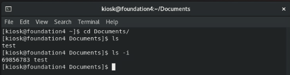
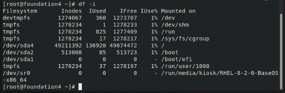
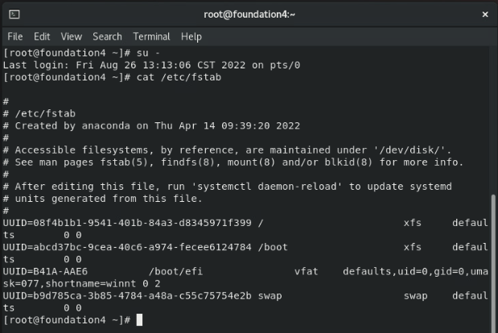
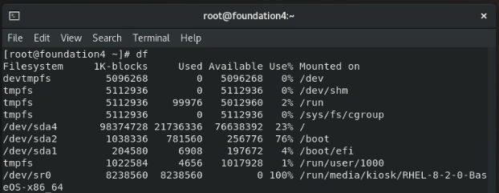
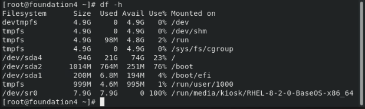
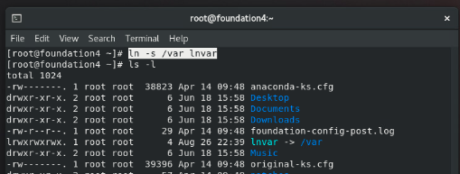
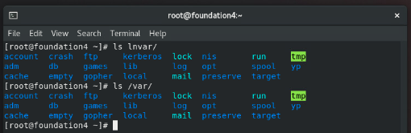
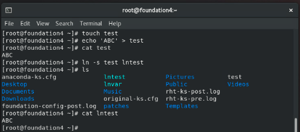
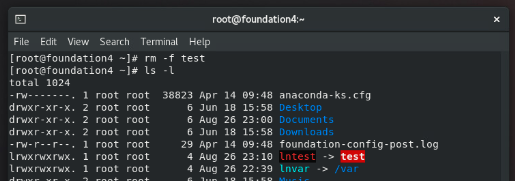

# CH 03：Linux 的檔案系統
課程筆記：Linux 我來教: CentOS / RHEL 8 新世代雲端

---

## 單元 1 - XFS 檔案系統

#### Linux 檔案格式系統簡介

從「CentOS」版本「7」開始，包含當前的版本「8」，其「檔案系統」開始採用「XFS」格式；「XFS」是由「SGI」在 1993 年為「Unix」系統所設計的「檔案格式」，是 64 位元日誌型檔案系統；效能優異。

雖然「XFS」在 1993 年就已經被研發出來，但在當時，「Linux」的檔案系統並沒有採用該項技術，而是使用「Ext」格式；例如「RedHat 6」所使用的「檔案格式」就是「Ext4」；「[Ext](https://zh.m.wikipedia.org/zh-tw/%E5%BB%B6%E4%BC%B8%E6%AA%94%E6%A1%88%E7%B3%BB%E7%B5%B1)」同樣是一種檔案系統，於 1992 年發表。

事實上，雖然「Ext」是專門為「Linux」設計的檔案系統，但真正被多個「Linux」發行版作為預設檔案系統的是「Ext2」，它改善了「Ext」的某些缺陷，如「inode」的不變性。

而後是「Ext3」，它是以「Ext2」為基礎再加上「日誌功能」；「日誌功能」是當系統被不正常關機，如「停電」時，能藉由「差異比對」的方式，快速地來確認硬碟資料的狀態。

然後是「Ext4」，它解同樣是基於「Ext3」的效能改善，也是目前很常見的「檔案格式」。

此外，在不同檔案格式的檔案擴增值亦不同，「Ext4」的最大擴增值為「1EB」，也就是等於一百萬個「1TB」，而「XFS」是「8EB」。

與「xfs」相關的指令如下：


---

## 單元 2 - 認識 inode

#### 簡介

在「Linux」系統中，檔案存放於硬碟中，但「檔案」的相關資訊是記錄在一種名為「[inode](https://zh.wikipedia.org/zh-tw/Inode)」的資料結構，它其實是一個扁平陣列的結構；事實上，我們可將它理解為一張表，其上面記錄著「Linux」系統中，其對應檔案的資訊，如檔名、更動時間、權限、檔案存放的區塊位址⋯等；其示意圖如下：


在檔案系統中每個「檔案系統物件」都會對應一個「inode」資料，並用一個整數值來辨識；這個整數常被稱為「i-number」，且必定是「唯一值」。

而我們也可以使用指令「`ls -i`」來查看「i-number」，如下：



此外，因為「inode」的儲存位置、總條目數量都是固定的，因此可以藉由「i-number」去索引尋找特定的「inode」表；但這也意味著，「inode」是可能被用完的；雖然這件事情通常不會發生。

若想要某目錄的「inode」使用量，可以使用指令「`df -i`」，如下：



---

## 單元 3 - 檔案系統相關指令與操作說明

#### 「fstab」簡介

在「Linux」中，有一個相當重要的配置文件為「/etc/fstab」；「[fstab](https://en.wikipedia.org/wiki/Fstab)」，全名為「File system table」，它的作用是設定或顯示硬碟分割區或其化儲存裝置的掛載狀況或掛載方式，如開機自動掛載等相關選項，其內容如下：



若要了解「硬碟」的狀況，可以使用指令「df」，如下：



但「df」所顯示的資訊並不容易我們平常閱讀，因此，我們通常會搭配參數「h」使用，其參數的意思是「human readable」，它會將其中的數字改為我們常用的單位標示，如下：



#### 指令資訊查找方式：「man」、「info」

若我們想要查找某個指令的用法，我們可以藉由指令：「man」；其含義是「manual」的意思。

此外，除了「man」，我們也可以用「info」來獲取指令的使用資訊；相較於「man」，「info」的介紹就相對白話，對於使用情境的描述更多。

#### 資料夾管理指令：「du」

除了之前的「df」，還有一個常見的指令「du」，是「disk usage」的縮寫，它可以查詢資料夾空間的使用狀況；其同樣有參數「h」，同樣是「human readable」的意思；此外，亦可以搭配「d」來設定要查詢的資料夾深度。

---

## 單元 4 - 認識連結（Link）- 符號連結與硬連結

在「Linux」系統中，連結有兩種，分別為「符號連結」與「硬連結」，事實上，「連結」也是檔案的一種，其允許一個檔案參考到另外一個檔案。

#### 符號連結：「symbolic link」

首先是「符號連結」，其建立的方式是藉由指令「ln」，再加上參數「-s」，舉例來說，我們要建立一個「Link」檔案，要參考到「/var」，其指令如下：

```shell
# Link 的名稱是：lnvar
ln -s /var lnvar
```

其目錄資料如下：



我們可以發現，「lnvar」項目的首碼是「l」，在目錄的章節我們曾說過，第一碼代表該項目的檔案類型，「d」代表為「資料夾」，「-」代表為「檔案」，而「l」，就是所謂的「符號連結」。

事實上，它就是個捷徑，例如，當我們「ls」剛建立的連結「lnvar」時，其顯示的內容就等同於直接對「/var」執行「ls」，如下：



符號連結不僅是可以連結到「目錄」，也可以連結到「檔案」。

舉個例子，我們在家目錄下建立一個「test」檔案，並簡單賦予一些內容，然後再建立一個連結檔案，名稱為「lntest」，然後再用「cat」指令來驗證，其顯示如下：



倘若「被連結」的檔案或目錄被刪除時，則「Link」會呈現「紅底反白」，表示錯誤，如下：



此外，符合連結同樣可以藉由「rm」指令來移除，事實上，我們可以將之視為一種檔案。

#### 硬連結：「hard link」

---

###### tags: `Linux` `RHEL 8` `CentOS 8`
