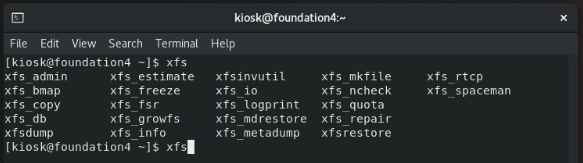

# CH 03：Linux 的檔案系統
課程筆記：Linux 我來教: CentOS / RHEL 8 新世代雲端

---

## 單元 1 - XFS 檔案系統

#### Linux 檔案格式系統簡介

從「CentOS」版本「7」開始，包含當前的版本「8」，其「檔案系統」開始採用「XFS」格式；「XFS」是由「SGI」在 1993 年為「Unix」系統所設計的「檔案格式」，是 64 位元日誌型檔案系統；效能優異。

雖然「XFS」在 1993 年就已經被研發出來，但在當時，「Linux」的檔案系統並沒有採用該項技術，而是使用「Ext」格式；例如「RedHat 6」所使用的「檔案格式」就是「Ext4」。

事實上，「Ext4」的前身是「Ext3」，而「Ext4」改善了「Ext3」的效能。

然而，「Ext3」」的前身是「Ext2」；但「Ext3」」與「Ext2」的最主要差異不是效能，而是日誌功能，也就是說，「Ext3」」是以「Ext2」為基礎再加上「日誌功能」；「日誌功能」是當系統被不正常關機，如「停電」時，能藉由「差異比對」的方式，快速地來確認硬碟資料的狀態。

此外，在不同檔案格式的檔案擴增值亦不同，「Ext4」的最大擴增值為「1EB」，也就是等於一百萬個「1TB」，而「XFS」是「8EB」。

與「xfs」相關的指令如下：

#### 認識 inode

在「Linux」系統中，檔案存放於硬碟中，但「檔案」的相關資訊是記錄在一種名為「[inode](https://zh.wikipedia.org/zh-tw/Inode)」的資料結構，它其實是一個扁平陣列的結構；事實上，我們可將它理解為一張表，其上面記錄著「Linux」系統中，其對應檔案的資訊，如檔名、更動時間、權限、檔案存放的區塊位址⋯等；其示意圖如下：

在檔案系統中每個「檔案系統物件」都會對應一個「inode」資料，並用一個整數值來辨識；這個整數常被稱為「i-number」，且必定是「唯一值」。

而我們也可以使用指令「`ls -i`」來查看「i-number」，如下：

此外，因為「inode」的儲存位置、總條目數量都是固定的，因此可以藉由「i-number」去索引尋找特定的「inode」表；但這也意味著，「inode」是可能被用完的；雖然這件事情通常不會發生。

若想要某目錄的「inode」使用量，可以使用指令「`df -i`」，如下：

---

## 單元 2 - 

---

###### tags: `Linux` `RHEL 8` `CentOS 8`
