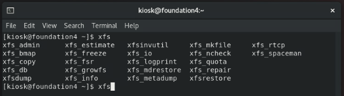

# 第三章：Linux 的檔案系統
課程筆記：Linux 我來教: CentOS / RHEL 8 新世代雲端

---

## 單元 1 - XFS 檔案系統

#### Linux 檔案格式系統簡介

從「CentOS」版本「7」開始，包含當前的版本「8」，其「檔案系統」開始採用「XFS」格式；「XFS」是由「SGI」在 1993 年為「Unix」系統所設計的「檔案格式」，是 64 位元日誌型檔案系統；效能優異。

雖然「XFS」在 1993 年就已經被研發出來，但在當時，「Linux」的檔案系統並沒有採用該項技術，而是使用「Ext」格式；例如「RedHat 6」所使用的「檔案格式」就是「Ext4」。

事實上，「Ext4」的前身是「Ext3」，而「Ext4」改善了「Ext3」的效能。

然而，「Ext3」」的前身是「Ext2」；但「Ext3」」與「Ext2」的最主要差異不是效能，而是日誌功能，也就是說，「Ext3」」是以「Ext2」為基礎再加上「日誌功能」；「日誌功能」是當系統被不正常關機，如「停電」時，能藉由「差異比對」的方式，快速地來確認硬碟資料的狀態。

此外，在不同檔案格式的檔案擴增值亦不同，「Ext4」的最大擴增值為「1EB」，也就是等於一百萬個「1TB」，而「XFS」是「8EB」。

與「xfs」相關的指令如下：

#### 認識 inode

---

###### tags: `Linux` `RHEL 8` `CentOS 8`
