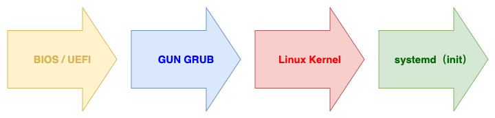
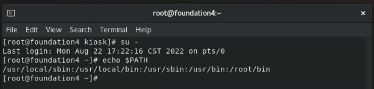
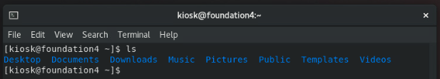
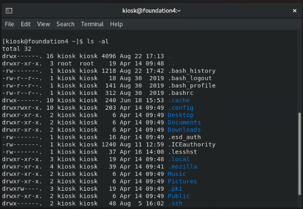
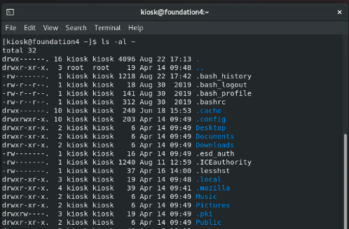

# 第二章：Linux 基礎操作指令
課程筆記：Linux 我來教: CentOS / RHEL 8 新世代雲端

---

## 單元 1 - Linux 的開機過程

#### BIOS / UEFI

此處的「[BIOS](https://zh.wikipedia.org/zh-tw/BIOS)」指的是傳統的「BIOS」系統，「BIOS」的全名為「Basic Input/Output System」，是在電腦啟動時與負責硬體相互溝通的主要程式；也是開機過程的第一站。

而「[UEFI](https://zh.wikipedia.org/zh-tw/%E7%B5%B1%E4%B8%80%E5%8F%AF%E5%BB%B6%E4%BC%B8%E9%9F%8C%E9%AB%94%E4%BB%8B%E9%9D%A2)」，全名為「Unified Extensible Firmware Interface」，也有人稱為「UEFI BIOS」，是「Legacy BIOS」的替代方案，示意圖如下：

#### GUN GRUB

而開機流程的第二站是「[GUN GRUB](https://zh.wikipedia.org/zh-tw/GNU_GRUB)」，它是一套主要用於「[Unix-like system](https://zh.wikipedia.org/zh-tw/%E7%B1%BBUnix%E7%B3%BB%E7%BB%9F)」的「[啟動程式（Bootloade）](https://zh.wikipedia.org/zh-tw/%E5%95%9F%E5%8B%95%E7%A8%8B%E5%BC%8F)」；我們可以將其視作「Linux」的「開機管理程式」，譬如在系統出問題時，我們就可以藉由「GRUB」中的一個設定來進入單人模式並執行系統的修復作業，例如在「RHCSA」認證的常見考題中，其就有透過獲取「Root」權限來修改密碼。

#### Linux Kernel

接著是「[Linux 核心](https://zh.m.wikipedia.org/zh-tw/Linux%E5%86%85%E6%A0%B8)」，它是一種開源的「Unix-like」作業系統單核心。

#### systemd（init）

當「Linux」在啟動時載入「Linux 核心」後，便會進到「init」，由「init」完成剩餘的開機過程，譬如載入執行級別、載入服務，或是否啟動文字「Shell」或是「圖形化」介面⋯等。

此外，大部分的「Linux 發行版」都已採用新的「systemd」來來替代傳統的「init」。

---

## 單元 2 - 指令操作、變身為超級使用者

#### 常見的符號

| 符號  | 說明                         |
| :---: | ---------------------------- |
|   ~   | 代表家目錄。                 |
|   /   | 代表根目錄。                 |
|   #   | 代表目前用戶權限為「Root」。 |
|   $   | 代表為一般使用者。           |

#### 常用的指令：

|  指令  | 說明                             |
| :----: | -------------------------------- |
|  pwd   | 顯示當前路徑。                   |
| whoami | 顯示當前用戶。                   |
|  echo  | 打印。                           |
| clear  | 清除畫面。                       |
|   su   | 變身為超級使用者「Super User」。 |

額外補充個知識點，一般當我們在使用「su」這個指令時，我們會經常會在後面加個「-」字號，變成「`su -`」，而非直接使用「su」；其主要原因與環境變數有關。

首先，我們可以藉由指令「`echo $PATH`」來打印環境變數的路徑，顯示結果如下：

然後，使用「`su`」變身為「Super User」，再執行一次指令「`echo $PATH`」，顯示結果如下：

然後，再使用「`su -`」變身為「Super User」，同樣執行指令「`echo $PATH`」，顯示結果如下：

另外，清除畫面除了輸入指令「clear」之外，亦可以使用一個「特殊字元」，輸入該特殊字元的方式是輸入「Ctrl + L」。

---

## 單元 3 - 基礎資料夾切換、列表、別名

#### 切換資料夾

在「Linux」中，切換資料夾的方法是藉由指令「cd」，並在後面接上路徑，我們可以直接輸入路徑位置，亦可使用「符號」來表示位置，如下：

| 符號  | 說明             |
| :---: | ---------------- |
|   ~   | 代表家目錄。     |
|   /   | 代表根目錄。     |
|   .   | 代表當前目錄。   |
|  ..   | 代表上一層目錄。 |

#### 顯示資料夾內容

在「Linux」中，若要顯示資料夾內容的可以使用指令「ls」，顯示結果如下：

其中，在預設的情況下，藍色表示資料夾。

若要顯示目錄詳細內容，加入參數「l」，指令為「`ls -l`」，顯示結果如下：

若要顯示隱藏檔案，則使用參數「a」，顯示結果如下：

其中，在「目錄名稱」前有個點「.」，就是隱藏檔；而僅有「.」的是指當前目錄，而「..」當然就是指「上一層目錄」。

亦可以混合著使用，顯示結果如下：

另外，「ls」除了可以顯示當前目錄內容外，我們亦可以指定目錄，只要在指令後面接上目錄位置即可，以「根目錄」為例，如下：

#### 別名

在某些情況下，我們會經常地使用某特定參數的指令，因此，為了方便使用者能簡潔且快速地操作，「Linux」提供了「alias」系統，並提供預設的「別名」指令；我們可以藉由「alias」指令來得知目前的已經存在的「別名」指令，如下：

其中的「ll」就等同於「ls -l」，當然，除了預設的「別名」指令，亦可以自定義。

---

### 單元 4 - Linux 主要目錄與辨讀權限

#### 目錄辨讀

在檔案目錄下，每個檔案資料夾的最前面都有「10」個字碼，如下：

這「10」個字碼，都是表示著該檔案的分類與權限，首先是第一碼，若其為「d」，則代表當前的項目「資料夾」；若其為「-」，則代表為「檔案」。

接著，後面「9」碼是以「3」個為一組，依左至右依序為「rwx」，這「3」碼為一組的代碼是用來表示特地組群對目標「檔案資料夾」的操作權限；其中，「r」代表「讀取（read）」，「w」代表「寫入（wrirte）」，「x」則代表「執行（execute）」；此外，若「沒有」權限則是以「-」號表示。

使外，上述說「檔案資料夾」的操作權限以「3」碼為一組，共「3」組，依左至右依序分別為，第一組：「檔案的擁有者」，第二組：「與該檔案擁有者同群組的使用者」，以及第三組：「其它的使用者」。

#### Shell 的概念

其實此處的「Shell」是指「[Unix shell](https://zh.wikipedia.org/zh-tw/Unix_shell)」，它是一種「命令列介面」，是「Unix-like」作業系統下，「使用者」和「電腦」的互動介面，概念圖如下：

以目前來說，最常使用的「Unix shell」是「[Bash](https://zh.wikipedia.org/zh-tw/Bash)」。

#### 根目錄底下重要的資料夾

根目錄的項目清單如下：

##### 「bin」/「sbin」

首先是「bin」，它的意思是「Binary」，意即「機器碼的執行檔案」，因此「bin」目錄是放「執行檔」的目錄。

題外話，在「Windows」的作業系統中，要判斷該檔案是否為「執行檔」的方式是依據檔案的「副檔名」，例如「.exe」；但「Linux」的作業系統並非如此，而是會根據「檔案權限」中的「執行權限」來判定，即r「rwx」的「x」。

它代表著，對應的位置是「usr/bin」；

；而「bin」是一般「user」常用的「指令執行檔案」，像是，如下：

而「sbin」對應的是「spuer user」，